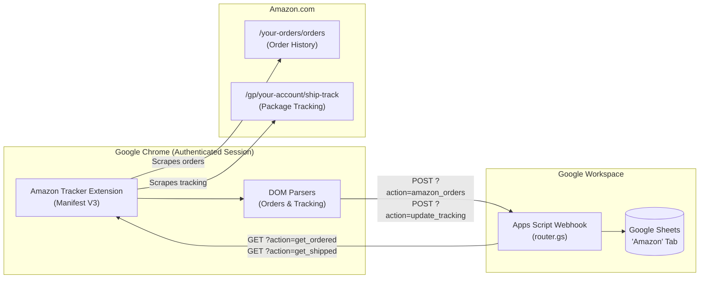

# Amazon Tracker 📦

An automated Amazon order and delivery tracking system that scrapes order history and package tracking updates directly from your Amazon account via a Chrome extension and synchronizes them into a Google Spreadsheet using Google Apps Script.

---

## 🏗️ Architecture



---

## 📁 Repository Structure

```text
amazon-trakker/
├── chrome-extension/              # Manifest V3 browser extension
│   ├── manifest.json              # Extension metadata & permissions
│   ├── background.js              # Background service worker, queues & HTTP sync
│   ├── amazon-order-list.js       # DOM parser for Amazon order history
│   ├── amazon-package-tracking.js # DOM parser for Amazon package tracking
│   ├── options.html / .js / .css  # Settings dashboard (webhooks, timers, schedules)
│   └── popup.html / .js / .css    # Action launcher popup
├── spreadsheet-gs/
│   └── spreadsheet.csv            # Reference schema / column definitions
├── router.gs                      # Main webhook router (doGet & doPost)
├── amazon_new_orders.gs           # Ingests & deduplicates new orders into sheet
├── amazon_get_ordered.gs          # Queries sheet for links needing initial tracking
├── amazon_get_shipped.gs          # Queries sheet for links with in-transit packages
├── amazon_update_tracking.gs      # Updates package tracking & status in sheet
├── amazon_auto_updates.gs         # Reconciles delivery statuses (Delivered, Cancelled, etc.)
└── test_input_data.gs             # Debugging & raw payload testing
```

---

## 🚀 Assembly & Setup Guide

Follow these 5 steps to assemble and run the system:

### 1. Create the Google Spreadsheet

1. Create a new Google Spreadsheet at [sheets.new](https://sheets.new).
2. Rename the active sheet tab to **`Amazon`** *(exact match, case-sensitive)*.
3. Paste the following 16 column headers into row `1` (columns `A` through `P`):

| Col | Header | Description |
|:---:|---|---|
| **A** | `Order date` | Date order was placed |
| **B** | `Order #` | Amazon Order ID (used for deduplication) |
| **C** | `Package id` | Amazon package identifier |
| **D** | `Est. delivery date` | Estimated delivery text |
| **E** | `Order details` | `=HYPERLINK` to Amazon order page |
| **F** | `Tracking page` | Direct URL to package shipment tracking |
| **G** | `Item name` | `=HYPERLINK` to product page |
| **H** | `Image` | `=IMAGE()` displaying item thumbnail |
| **I** | `Qty` | Item quantity |
| **J** | `Status` | `Ordered`, `Shipped`, `Out for delivery`, `Delivered`, etc. |
| **K** | `Last update` | Timestamp of latest sync |
| **L** | `Tracking no` | Carrier tracking number with link |
| **M** | `Attn Required` | Checkbox flag when tracking number changes |
| **N** | `Product link` | Raw product URL |
| **O** | `Comments` | Manual notes |
| **P** | `History` | Audit trail of status updates |

*(Optional)* In column **M** (`Attn Required`), highlight rows `2:1000` and choose **Insert → Checkbox**.

---

### 2. Add Scripts to Google Apps Script

1. In your spreadsheet, open **Extensions → Apps Script**.
2. Create script files using the **+** button next to **Files** and paste the code from this repo:
   - `router.gs`
   - `amazon_new_orders.gs`
   - `amazon_get_ordered.gs`
   - `amazon_get_shipped.gs`
   - `amazon_update_tracking.gs`
   - `amazon_auto_updates.gs`
   - `test_input_data.gs`
3. Ensure `logExecution` helper is available (e.g. at the bottom of `router.gs`):

```javascript
function logExecution(logSheet, startTime, action, parsedCount, newCount, skippedDuplicates, insertedRows, details) {
  if (!logSheet) return;
  const skippedStr = Array.isArray(skippedDuplicates) ? skippedDuplicates.join(", ") : String(skippedDuplicates || "");
  logSheet.appendRow([
    new Date(),
    action,
    parsedCount,
    newCount,
    skippedStr,
    insertedRows,
    details
  ]);
}
```

---

### 3. Deploy the Apps Script Web App

1. Click **Deploy → New deployment**.
2. Click the gear icon ⚙️ next to *Select type* and choose **Web app**.
3. Configure deployment:
   - **Description**: `Amazon Tracker Webhook`
   - **Execute as**: `Me (your_email@gmail.com)`
   - **Who has access**: **`Anyone`** *(Required so the extension can POST/GET data without Google OAuth headers)*
4. Click **Deploy**.
5. Click **Authorize access**, select your Google account, click **Advanced → Go to Untitled project (unsafe)**, and select **Allow**.
6. Copy your **Web app URL**:
   ```text
   https://script.google.com/macros/s/AKfycb.../exec
   ```

> [!NOTE]
> When modifying `.gs` files in the future, always update your deployment via **Deploy → Manage deployments → Edit (pencil icon) → New version → Deploy**.

---

### 4. Install the Chrome Extension

1. Open Google Chrome and go to `chrome://extensions/`.
2. Toggle **Developer mode** to **On** (top right).
3. Click **Load unpacked** (top left).
4. Select the `chrome-extension` folder inside this repository.
5. Pin **Amazon Tracker** 📦 to your browser toolbar.

---

### 5. Configure Extension Webhooks

Right-click the extension icon in Chrome and select **Options** (or click the extension icon → **Settings**):

Replace `YOUR_WEB_APP_URL` with your deployed URL (`https://script.google.com/macros/s/.../exec`).

#### General Settings
- **Min page open time**: `1.0`
- **Max page open time**: `3.0`
- **Close workflow tabs after sending**: `ON`

#### Get new orders settings
- **Send-results Webhook URL**:
  ```text
  YOUR_WEB_APP_URL?action=amazon_orders
  ```
- **Order pages**: `1` (or enter `5` to backfill recent history)
- **Button name**: `Get new orders`

#### Check Order Delivery status settings (General Workflow)
- **Button name**: `Check Ordered`
- **Fetch link list for general workflow**: `ON`
- **Fetching URL**:
  ```text
  YOUR_WEB_APP_URL?action=get_ordered
  ```
- **Max links to open**: `10` (or leave blank for unlimited)
- **Send-results Webhook URL**:
  ```text
  YOUR_WEB_APP_URL?action=update_tracking
  ```

#### Additional Workflows (Workflow 1 - Shipped Packages)
- Expand **Additional Workflow 1** and toggle **ON**
- **Button name**: `Check Shipped`
- **Color**: `#059669` (Green)
- **Fetching URL**:
  ```text
  YOUR_WEB_APP_URL?action=get_shipped
  ```
- **Max links to open**: `10`
- **Send-results Webhook URL**:
  ```text
  YOUR_WEB_APP_URL?action=update_tracking
  ```

---

## ⚡ Usage & Automation

1. **Get New Orders**:
   - Ensure you are logged into Amazon in Chrome.
   - Click the extension icon and click **Get new orders**.
   - The extension will navigate through your orders, parse items, thumbnails, and order tracking links, and push them to Google Sheets.
2. **Track Shipments**:
   - Click **Check Ordered** or **Check Shipped**.
   - The extension retrieves tracking URLs from the sheet that need updates, visits them with natural randomized delays, extracts tracking IDs and delivery estimates, and updates the sheet.
3. **Scheduled Runs & Idle Execution**:
   - In extension **Options**, toggle **Launch automatically** and set desired intervals, operating hours, or require the computer to be idle.
4. **Auto-Reconcile Statuses**:
   - In Apps Script, add a time-driven trigger for `syncAmazonStatuses` (e.g., every 1-2 hours) to auto-update statuses like `Delivered`, `Cancelled`, or `Refunded`.
